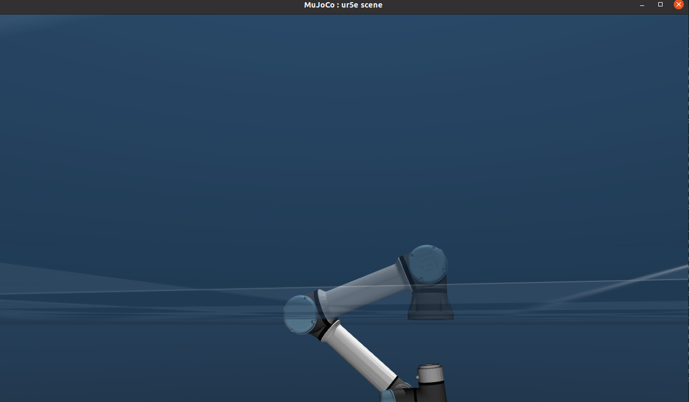
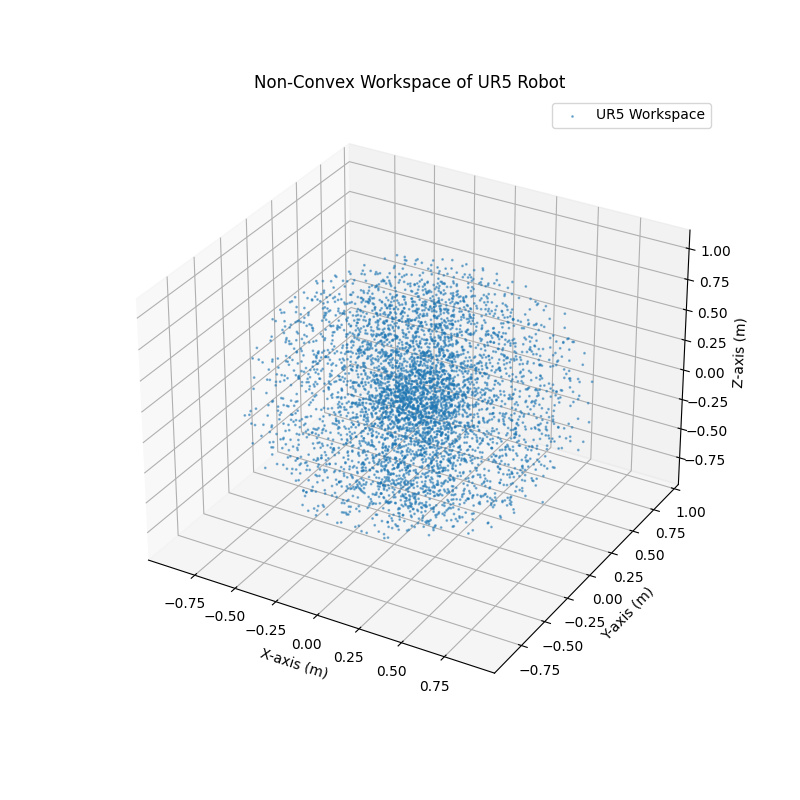

# Report: 

## Assignment one:
This report documents the steps taken to modify an example in the Qontrol package to achieve specific Cartesian movements using a UR5 robotic arm. The modifications involve moving the robot by +0.1m along the x-axis and then -0.2m along the z-axis.

## Steps Followed

### 1. Cloning the Repository
First, I cloned the Qontrol package repository to my local system using the command:
```bash
git clone <repository-url>
```

### 2. Installation & Build
Following the installation instructions provided in the repository, I built the package using:
```bash
make -j4
```
This ensured that the necessary dependencies were compiled and ready for execution.

### 3. Running the UR5 Robot Example
To verify proper installation and operation, I executed the UR5 robot example with:
```bash
./velocityQontrol ur5
```
This launched the simulation with default movement parameters.

### 4. Understanding the Code
I explored the `Example` directory to understand how the robot's movements are controlled. The goal was to determine how to modify the example to achieve the required Cartesian displacements.

### 5. Identifying the Modification Points
I found that the movement commands were controlled using `trajectory.csv`. The relevant Cartesian positions for the desired movement were defined as:

1. Position 1: x = 0.1, y = 0.0, z = 0.0
2. Position 2: x = 0.1, y = 0.0, z = -0.2

### 6. Implementing the Modifications
I updated `trajectory.csv` to include these waypoints, ensuring that the robot would first move along the x-axis and then along the z-axis.

### 7. Observing the Robot's Behavior
Upon running the modified example, the robot successfully moved to the specified positions (as shown in the attached images). However, the joint configuration did not behave as expected.

## Results and Observations
- The robot reached the target Cartesian positions but exhibited unexpected joint configurations.
- This occurred because the movement was defined in Cartesian space rather than joint space, leading to suboptimal joint trajectories.
- The robot moved quickly and unsafely since I manually assigned velocity values.
- Proper synchronization of joint movements is necessary due to the multi-motor system.

## Conclusion
1. The undesired joint configuration results from Cartesian movement definitions instead of joint-space control.
2. Velocity and torque values should not be manually assigned arbitrarily. Instead, they should be determined by a controller.
3. To ensure synchronized and smooth motion, a more advanced control method like Model Predictive Control (MPC) would help optimize velocity and torque distribution across joints.

This experiment highlights the importance of trajectory planning and control strategies in robotic motion execution.

## Attached Screenshots




---
## Assignment 2a: Non-Convex Workspace of UR5 Robot

### Introduction
I was investigating the limited space where the UR5 robot cannot reach. To do this, I first searched for the URDF file of the UR5 robot, which provides kinematic and dynamic details. With this information, I randomly sampled poses in space and checked whether the robot, considering its joint limitations, could reach these positions or not.

### Finding the URDF
The URDF file for the UR5 robot can be found in several open-source repositories on GitHub. Searching for "UR5 URDF GitHub" provides various sources where the UR5 model is available. After obtaining the URDF, I used the `urdfpy` library to load and parse it.

### Code Implementation
The following Python script simulates the workspace of the UR5 robot by randomly generating joint configurations and computing the reachable end-effector positions.


#### Code:
```python
import numpy as np
import matplotlib.pyplot as plt
from urdfpy import URDF

# Load UR5 URDF file
ur5_urdf = URDF.load("/home/farid/qontrol/examples/resources/ur5/ur5_arm.urdf")  # <-- Change to your URDF file path

# Extract joint limits (min, max for each joint)
joint_limits = np.array([[j.limit.lower, j.limit.upper] for j in ur5_urdf.joints if j.limit])

# Define the number of joints (UR5 has 6 revolute joints)
n_joints = joint_limits.shape[0]

# Number of random samples for workspace estimation
n_samples = 5000

# Sample random joint configurations within limits
joint_angles = np.random.uniform(
    joint_limits[:, 0],  # Lower limits
    joint_limits[:, 1],  # Upper limits
    (n_samples, n_joints)
)

# Compute forward kinematics for each joint configuration
end_effector_positions = np.array([
    ur5_urdf.link_fk(cfg)[ur5_urdf.links[-1]][0:3, 3]
    for cfg in joint_angles
])

# Extract X, Y, Z coordinates
x, y, z = end_effector_positions[:, 0], end_effector_positions[:, 1], end_effector_positions[:, 2]

# Plot the workspace in 3D
fig = plt.figure(figsize=(8, 8))
ax = fig.add_subplot(111, projection='3d')

ax.scatter(x, y, z, s=1, alpha=0.5, label="UR5 Workspace")

ax.set_xlabel("X-axis (m)")
ax.set_ylabel("Y-axis (m)")
ax.set_zlabel("Z-axis (m)")
ax.set_title("Non-Convex Workspace of UR5 Robot")
ax.legend()
plt.show()
```

#### Explanation:
1. **Loading the URDF File**
   - The `urdfpy` library is used to parse the URDF file of the UR5 robot.

2. **Extracting Joint Limits**
   - The script extracts the joint limits (lower and upper bounds) for each revolute joint.

3. **Generating Random Joint Configurations**
   - A total of 5000 random joint angles are sampled within the defined joint limits.

4. **Computing Forward Kinematics**
   - The script calculates the end-effector position for each joint configuration using the `link_fk()` function from `urdfpy`.

5. **Visualizing the Workspace**
   - The resulting reachable points are plotted in a 3D space using `matplotlib`.

## Results
The following figure shows the **non-convex workspace** of the UR5 robot, where the scattered points represent reachable positions:



## Conclusion
By randomly sampling joint angles and checking the resulting end-effector positions, we have visualized the UR5 robot’s **non-convex workspace**. The UR5 does not have full reachability across its theoretical workspace due to joint constraints, leading to gaps in the reachable space. This experiment highlights the importance of understanding a robot’s kinematic limitations when designing robotic applications.

