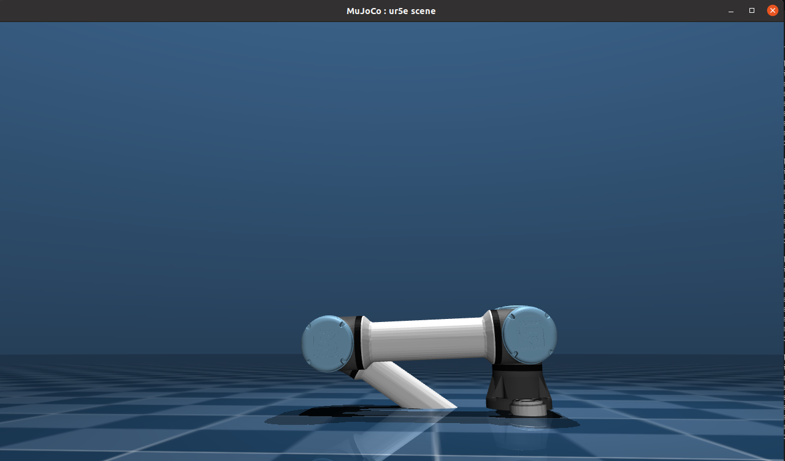

# Report: 

## Assignment one:
This report documents the steps taken to modify an example in the Qontrol package to achieve specific Cartesian movements using a UR5 robotic arm. The modifications involve moving the robot by +0.1m along the x-axis and then -0.2m along the z-axis.

## Steps Followed

### 1. Cloning the Repository
First, I cloned the Qontrol package repository to my local system using the command:
```bash
git clone <repository-url>
```

### 2. Installation & Build
Following the installation instructions provided in the repository, I built the package using:
```bash
make -j4
```
This ensured that the necessary dependencies were compiled and ready for execution.

### 3. Running the UR5 Robot Example
To verify proper installation and operation, I executed the UR5 robot example with:
```bash
./velocityQontrol ur5
```
This launched the simulation with default movement parameters.

### 4. Understanding the Code
I explored the `Example` directory to understand how the robot's movements are controlled. The goal was to determine how to modify the example to achieve the required Cartesian displacements.

### 5. Identifying the Modification Points
I found that the movement commands were controlled using `trajectory.csv`. The relevant Cartesian positions for the desired movement were defined as:

1. Position 1: x = 0.1, y = 0.0, z = 0.0
2. Position 2: x = 0.1, y = 0.0, z = -0.2

### 6. Implementing the Modifications
I updated `trajectory.csv` to include these waypoints, ensuring that the robot would first move along the x-axis and then along the z-axis.

### 7. Observing the Robot's Behavior
Upon running the modified example, the robot successfully moved to the specified positions (as shown in the attached images). However, the joint configuration did not behave as expected.

## Results and Observations
- The robot reached the target Cartesian positions but exhibited unexpected joint configurations.
- This occurred because the movement was defined in Cartesian space rather than joint space, leading to suboptimal joint trajectories.
- The robot moved quickly and unsafely since I manually assigned velocity values.
- Proper synchronization of joint movements is necessary due to the multi-motor system.

## Conclusion
1. The undesired joint configuration results from Cartesian movement definitions instead of joint-space control.
2. Velocity and torque values should not be manually assigned arbitrarily. Instead, they should be determined by a controller.
3. To ensure synchronized and smooth motion, a more advanced control method like Model Predictive Control (MPC) would help optimize velocity and torque distribution across joints.

This experiment highlights the importance of trajectory planning and control strategies in robotic motion execution.

## Attached Screenshots



